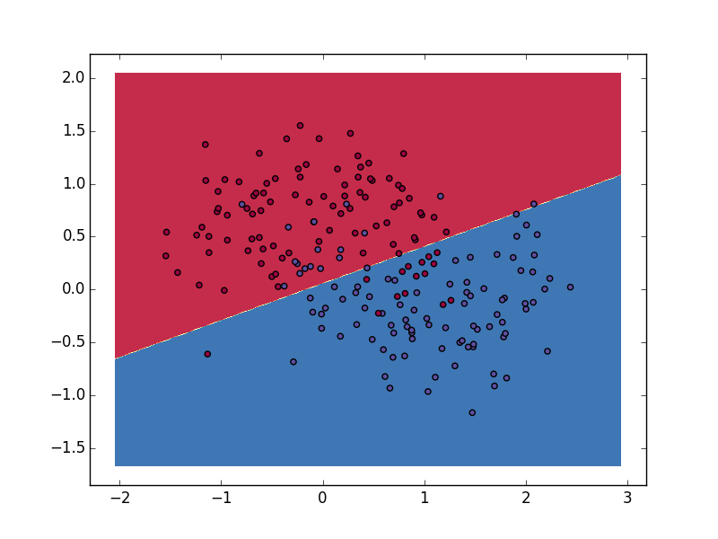
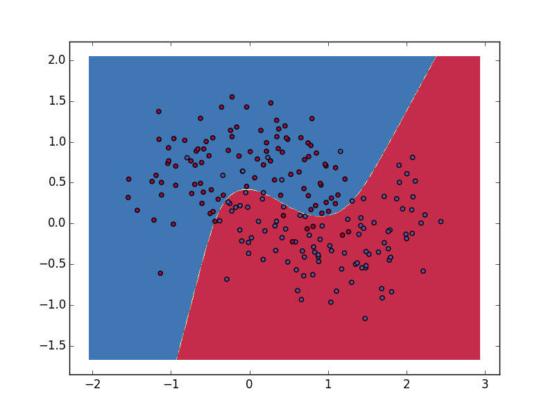

# classfication_demo

用logistic回归，SVM，神经网络实现分类算法

## Logistic分类

采用随机梯度下降方法实现。

```python
def train(self, num_iteration=150):
    """随机梯度上升算法

    Args:
        data (numpy.ndarray): 训练数据集
        labels (numpy.ndarray): 训练标签
        num_iteration (int): 迭代次数
    Returns
        weights (numpy.ndarray): logistic模型权重
    """
    for j in xrange(num_iteration):
        data_index = range(self.data_num)
        for i in xrange(self.data_num):
            # 动态学习速率
            alpha = 0.01
            rand_index = int(random.uniform(0, len(data_index)))
            error = self.label[rand_index] - sigmoid(sum(self.data[rand_index] * self.weights + self.b))
            self.weights += alpha * error * self.data[rand_index]
            self.b += alpha * error
            del(data_index[rand_index])
```

效果图：

## 神经网络

实现一个只有两层的神经网络

### BGD实现

批量梯度下降实现代码：

```python

def batch_gradient_descent(self, num_passes=20000):
    """批量梯度下降训练模型"""
    for i in xrange(0, num_passes):
        # Forward propagation
        z1 = self.data.dot(self.W1) + self.b1
        a1 = np.tanh(z1)
        z2 = a1.dot(self.W2) + self.b2
        exp_scores = np.exp(z2)
        probs = exp_scores / np.sum(exp_scores, axis=1, keepdims=True)

        # Backpropagation
        delta3 = probs

        delta3[range(self.num_examples), self.label] -= 1
        dW2 = (a1.T).dot(delta3)
        db2 = np.sum(delta3, axis=0, keepdims=True)
        delta2 = delta3.dot(self.W2.T) * (1 - np.power(a1, 2))
        dW1 = np.dot(self.data.T, delta2)
        db1 = np.sum(delta2, axis=0)

        # Add regularization terms (b1 and b2 don't have regularization terms)
        dW2 += self.reg_lambda * self.W2
        dW1 += self.reg_lambda * self.W1

        # Gradient descent parameter update
        self.W1 += -self.epsilon * dW1
        self.b1 += -self.epsilon * db1
        self.W2 += -self.epsilon * dW2
        self.b2 += -self.epsilon * db2
```

隐藏层只有三个神经元时的效果图：

### SGD实现

随机梯度下降实现：

```python

def stochastic_gradient_descent(self, num_passes=1000):
    """随机梯度下降训练模型"""
    for i in xrange(0, num_passes):
        data_index = range(self.num_examples)

        for j in xrange(self.num_examples):
            rand_index = int(np.random.uniform(0, len(data_index)))
            x = np.mat(self.data[rand_index])
            y = self.label[rand_index]

            # Forward propagation
            z1 = x.dot(self.W1) + self.b1
            a1 = np.tanh(z1)
            z2 = a1.dot(self.W2) + self.b2
            exp_scores = np.exp(z2)
            probs = exp_scores / np.sum(exp_scores, axis=1, keepdims=True)

            # Backpropagation
            delta3 = probs
            if y:
                delta3[0, 0] -= 1
            else:
                delta3[0, 1] -= 1
            dW2 = (a1.T).dot(delta3)
            db2 = np.sum(delta3, axis=0, keepdims=True)
            va = delta3.dot(self.W2.T)
            vb = 1 - np.power(a1, 2)
            delta2 = np.mat(np.array(va) * np.array(vb))
            dW1 = x.T.dot(delta2)
            db1 = np.sum(delta2, axis=0)

            # Add regularization terms (b1 and b2 don't have regularization terms)
            dW2 += self.reg_lambda * self.W2
            dW1 += self.reg_lambda * self.W1

            # Gradient descent parameter update
            self.W1 += -self.epsilon * dW1
            self.b1 += -self.epsilon * db1
            self.W2 += -self.epsilon * dW2
            self.b2 += -self.epsilon * db2

            del(data_index[rand_index])
```

隐藏层只有三个神经元时的效果图：

## SVM

暂时还没写完
